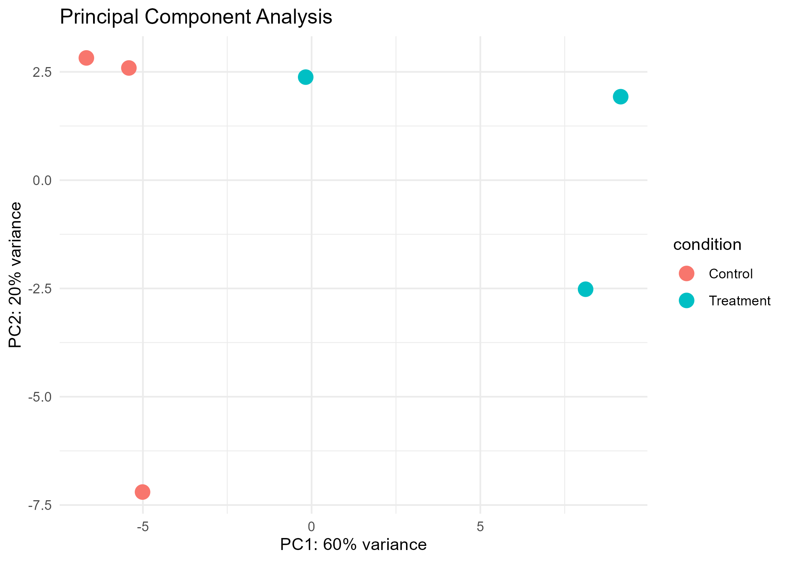
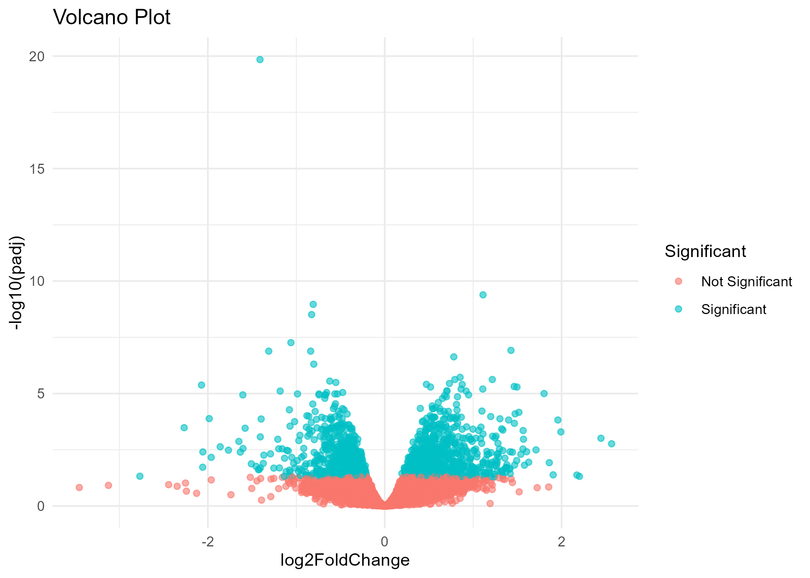
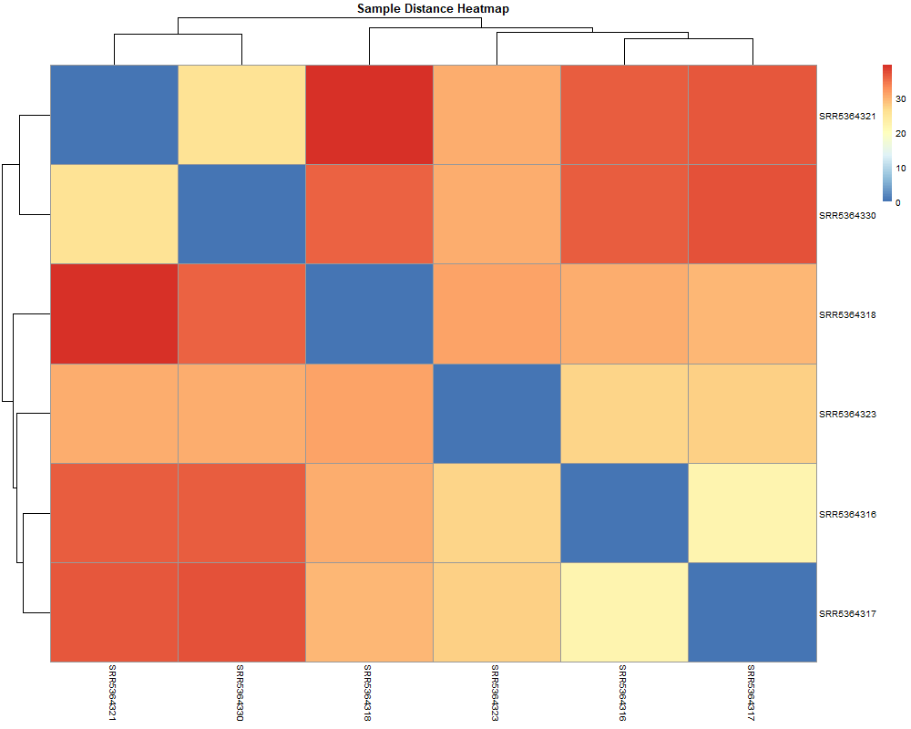

# Introduction

RNA sequencing (RNA-seq) is a powerful technique used to quantify gene expression across biological samples. In this project, RNA-seq count data from six *Mus musculus* (mouse) samples were analyzed using the DESeq2 package in R.

The dataset consisted of two experimental conditions with three biological replicates each. Differential gene expression analysis was performed to identify genes that were significantly upregulated or downregulated between treatment and control groups. Functional enrichment analyses were subsequently carried out using Gene Ontology (GO) Biological Process and KEGG pathway analysis to investigate the biological significance of the identified genes.

# Methods

## Data

- Organism: *Mus musculus* (Mouse)
- Samples: 6
- Conditions: Control (3) and Treatment (3)

## Differential Expression Analysis

Differential expression analysis was performed using the DESeq2 package.

The workflow included:

- Importing the count matrix
- Creating sample metadata
- Estimating size factors
- Estimating gene dispersions
- Performing Wald statistical tests
- Identifying significant genes using an adjusted p-value threshold of 0.05

## Visualization

The following visualizations were generated:

- Principal Component Analysis (PCA)
- Volcano Plot
- Top 50 Differentially Expressed Gene Heatmap
- Sample Distance Heatmap

## Functional Enrichment

GO Biological Process enrichment analysis was performed using the clusterProfiler package together with the org.Mm.eg.db annotation database.

KEGG pathway enrichment analysis was conducted using the mouse ("mmu") KEGG database.

# Results

## Differential Expression Summary

| Metric | Value |
|---------|------:|
| Total genes tested | 78,348 |
| Significant DEGs | 1,682 |
| Upregulated genes | 832 |
| Downregulated genes | 850 |

# Principal Component Analysis

```{r echo=FALSE, out.width="80%"}

```

The PCA plot demonstrates the clustering of biological replicates according to experimental condition, indicating that the treatment influenced overall gene expression profiles.

# Volcano Plot

```{r echo=FALSE, out.width="80%"}

```

The volcano plot illustrates the distribution of significantly upregulated and downregulated genes based on log2 fold change and adjusted p-values.

# Top Differentially Expressed Genes

```{r echo=FALSE, out.width="80%"}

```

The heatmap demonstrates distinct expression patterns among the most significantly differentially expressed genes across all samples.

# Sample Distance Heatmap

```{r echo=FALSE, out.width="80%"}
knitr::include_graphics("figures/Sample_distance_heatmap.png")
```

Samples clustered according to experimental condition, indicating high reproducibility among biological replicates.

# GO Biological Process Enrichment

```{r echo=FALSE}
go_table <- read.csv("GO_BP_results.csv")
knitr::kable(head(go_table,5))
```

The enriched GO terms primarily involve glial cell differentiation, neuron ensheathment, and regulation of cell projection organization, suggesting significant changes in neural development and cellular organization.

# KEGG Pathway Enrichment

```{r echo=FALSE}
kegg_table <- read.csv("KEGG_results.csv")
knitr::kable(head(kegg_table,3))
```

The most significantly enriched pathways include:

- IgSF CAM signaling
- MAPK signaling pathway
- Cell adhesion molecule (CAM) interaction

These pathways are associated with cell communication, intracellular signaling, and neural cell interactions.

# Discussion

Differential expression analysis identified 1,682 significantly regulated genes between the treatment and control groups. Principal component analysis demonstrated clear separation between experimental conditions, indicating consistent biological differences.

GO enrichment analysis revealed significant enrichment of biological processes associated with glial development and neuronal organization. Similarly, KEGG pathway analysis identified signaling and cell adhesion pathways that are important for neural communication and cellular interactions.

Overall, the results demonstrate that the experimental treatment produced widespread transcriptional changes affecting multiple biological pathways.

# Conclusion

This project successfully implemented a complete RNA-seq analysis workflow using DESeq2 in R. Differential expression analysis, visualization, and pathway enrichment analyses collectively revealed biologically meaningful transcriptional changes associated with the experimental treatment.

# References

Love MI, Huber W, Anders S. (2014). Moderated estimation of fold change and dispersion for RNA-seq data with DESeq2.

Yu G, Wang LG, Han Y, He QY. (2012). clusterProfiler: An R package for comparing biological themes among gene clusters.

Gene Ontology Consortium.

KEGG PATHWAY Database.